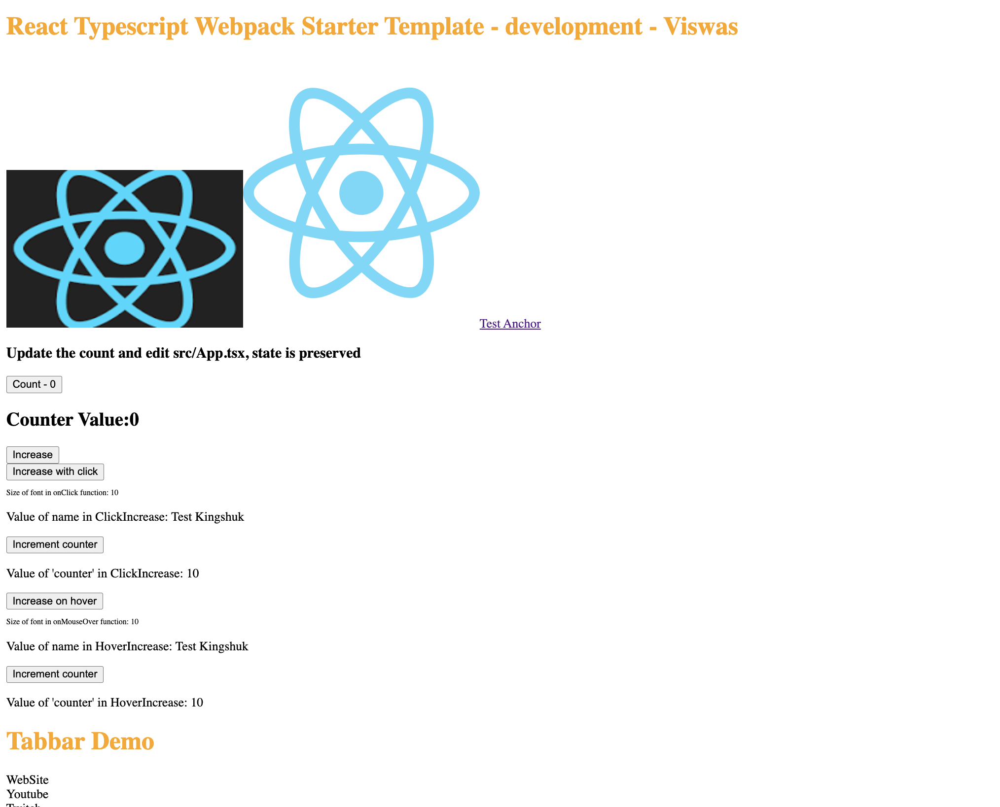

<html><center><h1>React Typescript Advanced Concepts</h1></center></html>

This is basic react typescript project which have certain react concepts



## Features

This template is built with the following concepts of React:

- [Lazy Loading](./src/LazyLoading/)
- [hoc](./src/hoc/)
- [Error Boundary](./src/ErrorBoundary.tsx) and its [usage](./src/App.tsx)

## Quick Start

- Install the dependencies

```cmd
  npm install
```

- Start the app in dev mode

```cmd
   npm start
```

- Build the app

```cmd
   npm run build
```
